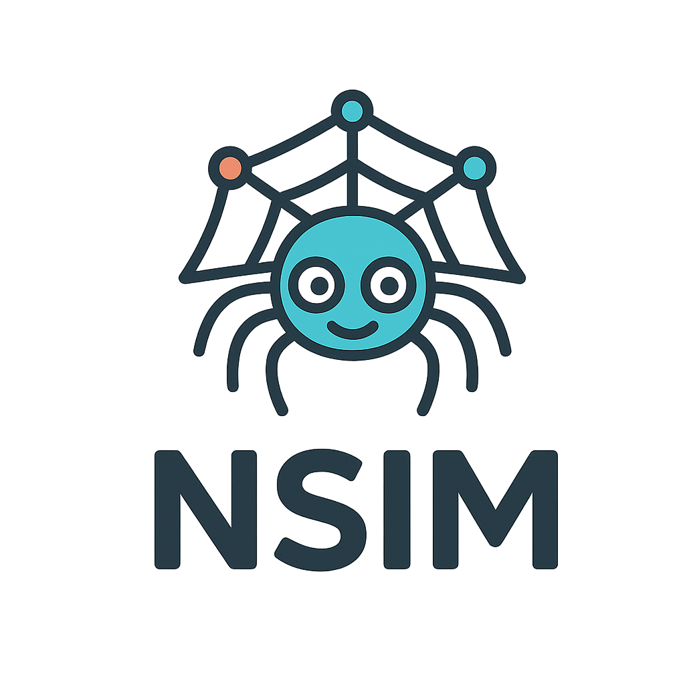

<p align="center">
  
</p>

# NSIM - Network Simulator

Payment network middleware connecting SSIM (Store Simulator) and BSIM (Bank Simulator).

## Overview

NSIM routes payment requests from merchants (SSIM) to card issuers (BSIM), handling:
- Payment authorization with automatic expiry
- Capture (full and partial)
- Void
- Refund (full and partial)
- Webhook notifications to merchants

## Quick Start

```bash
# Install dependencies
npm install

# Copy environment config
cp .env.example .env

# Run in development
npm run dev

# Build for production
npm run build
npm start

# Run tests
npm test
```

## API Endpoints

### Health
- `GET /health` - Service health check
- `GET /health/ready` - Readiness check with dependency status

### Payments (v1)
- `POST /api/v1/payments/authorize` - Request payment authorization
- `POST /api/v1/payments/:transactionId/capture` - Capture authorized payment
- `POST /api/v1/payments/:transactionId/void` - Void authorization
- `POST /api/v1/payments/:transactionId/refund` - Refund captured payment
- `GET /api/v1/payments/:transactionId` - Get transaction status

### Webhooks (v1)
- `POST /api/v1/webhooks` - Register webhook endpoint
- `GET /api/v1/webhooks/merchant/:merchantId` - List merchant webhooks
- `PATCH /api/v1/webhooks/:id` - Update webhook
- `DELETE /api/v1/webhooks/:id` - Delete webhook

### Diagnostics (v1)
- `POST /api/v1/diagnostics/analyze-token` - Analyze card token (for debugging)
- `GET /api/v1/diagnostics/token-types` - List supported token formats

## Architecture

```
┌────────────────────────────────────────────────────────────────────┐
│                    Payment Flow (Multi-Bank)                        │
├────────────────────────────────────────────────────────────────────┤
│                                                                    │
│  WSIM (Wallet) ──┐                              ┌→ BSIM (Default)  │
│                  ├──→ SSIM (Merchant) → NSIM ───┤                  │
│  Browser/App ────┘                       │      └→ NewBank BSIM    │
│                                          ↓                         │
│                                 Transaction Store                  │
│                                          ↓                         │
│                              Webhook Queue (BullMQ/Redis)          │
│                                                                    │
└────────────────────────────────────────────────────────────────────┘
```

### Multi-Bank Routing

NSIM supports routing payments to multiple BSIM (bank) instances. The target bank is determined from the card token:

| Token Format | Routing |
|--------------|---------|
| `wsim_bsim_xxx` | Routes to default BSIM |
| `wsim_newbank_xxx` | Routes to NewBank BSIM |
| `ctok_xxx` | Routes to default BSIM (consent flow) |
| JWT with `bsimId` claim | Routes based on claim value |

Transactions store the originating `bsimId` so subsequent operations (capture, void, refund) are routed to the correct bank.

### Payment Lifecycle

```
pending → authorized → captured → refunded
    ↓           ↓          ↓
  failed    declined    voided
              ↓
           expired (after 7 days)
```

### Webhook Events

- `payment.authorized` - Payment authorized, funds held
- `payment.captured` - Payment settled to merchant
- `payment.voided` - Authorization cancelled
- `payment.refunded` - Payment refunded to customer
- `payment.declined` - Payment declined by issuer
- `payment.expired` - Authorization expired
- `payment.failed` - Processing error

## Configuration

### Core Settings

| Variable | Description | Default |
|----------|-------------|---------|
| PORT | Server port | 3006 |
| AUTH_EXPIRY_HOURS | Authorization lifetime | 168 (7 days) |
| BSIM_MAX_RETRIES | Retry attempts for BSIM calls | 3 |
| BSIM_RETRY_DELAY_MS | Base retry delay | 500 |

### BSIM Connection (Single Bank)

| Variable | Description | Default |
|----------|-------------|---------|
| BSIM_BASE_URL | Default BSIM backend URL | http://localhost:3001 |
| BSIM_API_KEY | API key for default BSIM | dev-payment-api-key |

### Multi-Bank Configuration

Add additional banks using individual environment variables:

| Variable | Description | Default |
|----------|-------------|---------|
| BSIM_NEWBANK_URL | NewBank BSIM URL | - |
| BSIM_NEWBANK_KEY | NewBank API key | dev-newbank-api-key |
| BSIM_NEWBANK_NAME | NewBank display name | New Bank |
| DEFAULT_BSIM_ID | Default bank for unknown tokens | bsim |

Or use JSON format for all providers:

```bash
BSIM_PROVIDERS='[
  {"bsimId":"bsim","name":"Bank Simulator","baseUrl":"http://backend:3001","apiKey":"xxx"},
  {"bsimId":"newbank","name":"New Bank","baseUrl":"http://newbank:3001","apiKey":"xxx"}
]'
```

### Redis & Webhooks

| Variable | Description | Default |
|----------|-------------|---------|
| REDIS_HOST | Redis host | localhost |
| REDIS_PORT | Redis port | 6379 |
| REDIS_PASSWORD | Redis password | - |
| WEBHOOK_MAX_RETRIES | Webhook delivery retries | 5 |
| WEBHOOK_RETRY_DELAY_MS | Webhook retry delay | 1000 |
| WEBHOOK_TIMEOUT_MS | Webhook delivery timeout | 10000 |

## Integration

NSIM provides full HTTP integration with BSIM for payment processing:

- **Authorization** - Validates card tokens and holds funds via BSIM
- **Capture** - Settles authorized payments through BSIM
- **Void** - Cancels authorizations via BSIM
- **Refund** - Returns funds through BSIM

All BSIM calls include retry logic with exponential backoff for reliability.

See [Merchant Integration Guide](docs/MERCHANT_INTEGRATION_GUIDE.md) for complete merchant integration details.

### WSIM Wallet Integration

NSIM supports wallet-initiated payments from WSIM (Wallet Simulator):

```
WSIM → BSIM (get wallet_payment_token) → SSIM → NSIM → BSIM (authorize)
```

**Supported Token Types:**
| Prefix/Type | Source | Description |
|-------------|--------|-------------|
| `ctok_` | BSIM consent flow | Standard card token from user consent |
| `wsim_bsim_` | WSIM wallet | Wallet token from default BSIM |
| `wsim_newbank_` | WSIM wallet | Wallet token from NewBank BSIM |
| `wsim_{bsimId}_` | WSIM wallet | Wallet token from any configured BSIM |
| `wallet_payment_token` | JWT type | JWT-based wallet token (5-min TTL, must include `bsimId` claim) |

**Token Flow:**
1. User initiates payment in WSIM wallet
2. WSIM requests `wallet_payment_token` JWT from BSIM
3. WSIM passes token to SSIM merchant
4. SSIM sends authorization request to NSIM
5. NSIM forwards token to BSIM for validation and authorization
6. BSIM validates JWT signature, expiry, and card status

**Debugging Wallet Tokens:**
```bash
# Analyze a token without processing payment
curl -X POST http://localhost:3006/api/v1/diagnostics/analyze-token \
  -H "Content-Type: application/json" \
  -d '{"cardToken": "your-token-here"}'
```

Returns token analysis including prefix, JWT claims, expiry status, and warnings.

## Testing

```bash
npm test              # Run all tests
npm run test:watch    # Watch mode
npm run test:coverage # Coverage report
```

181 unit tests across 13 test suites (~85% code coverage) covering payment flows, multi-BSIM routing, webhooks, and API routes.

## Docker

```bash
docker build -t nsim .
docker run -p 3006:3006 nsim
```

Multi-stage build with non-root user for security. Integrated into BSIM's docker-compose as `payment-network` service.
